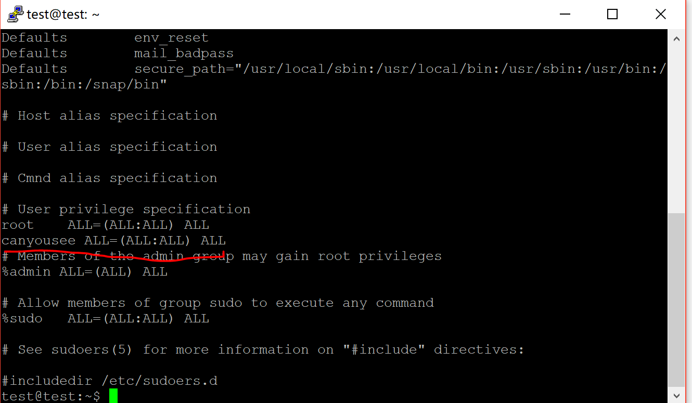
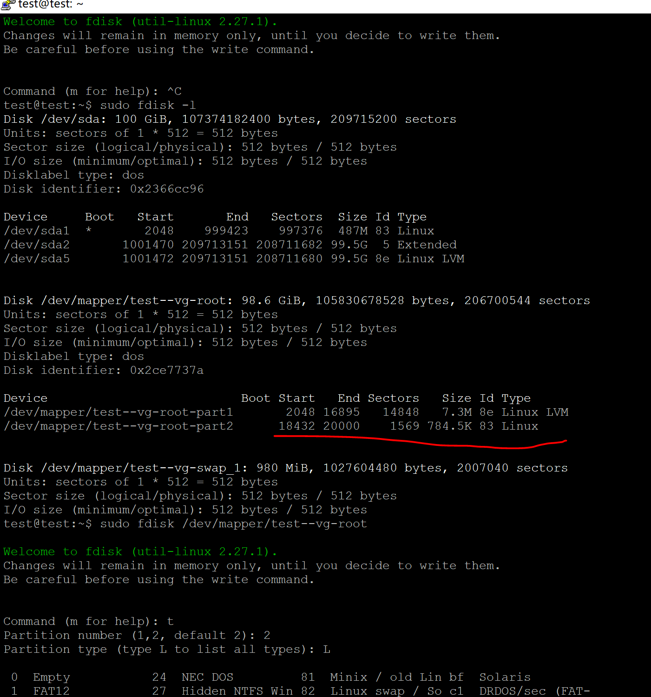
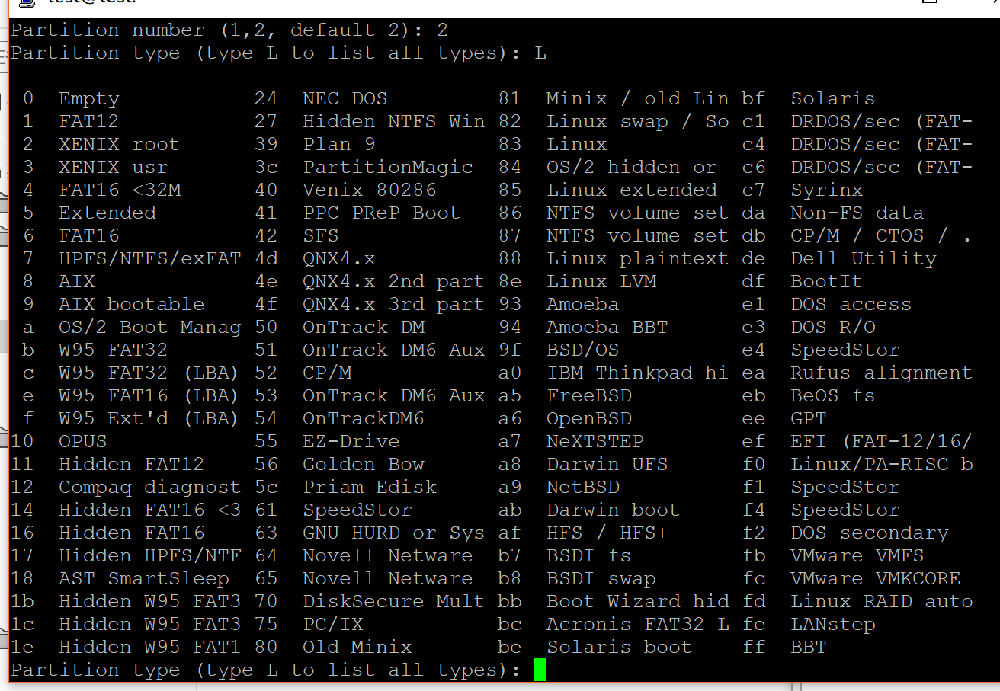
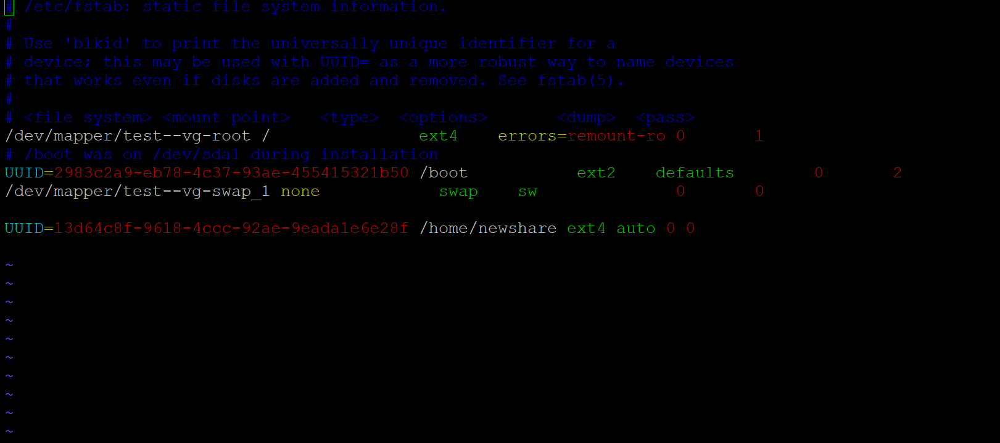
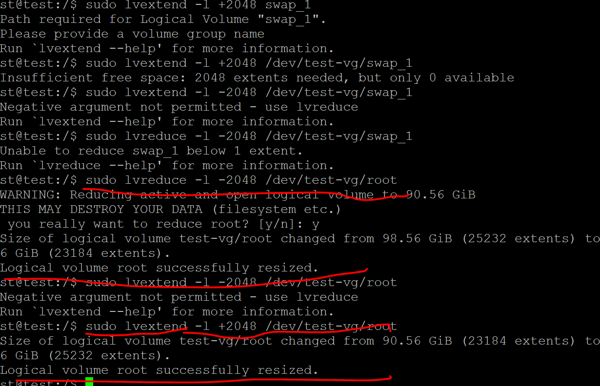
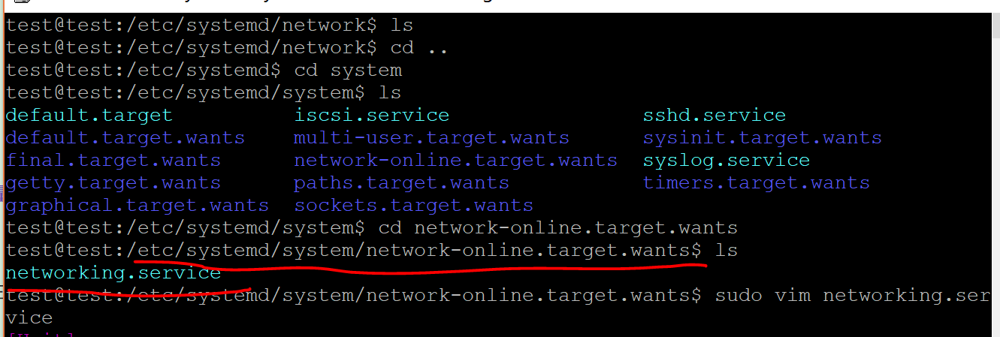
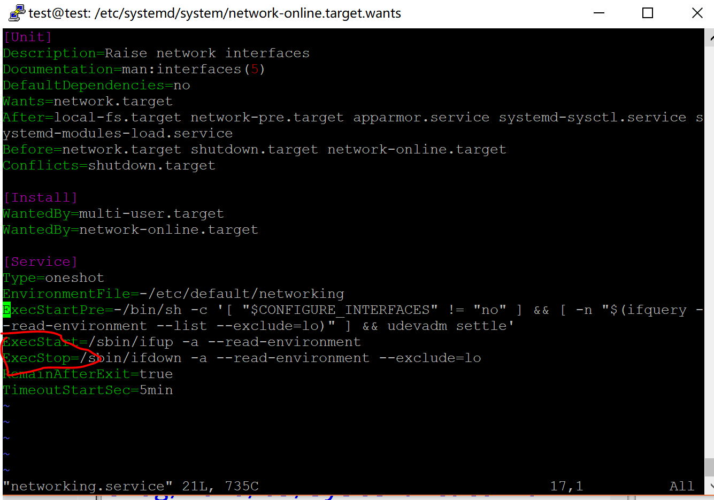
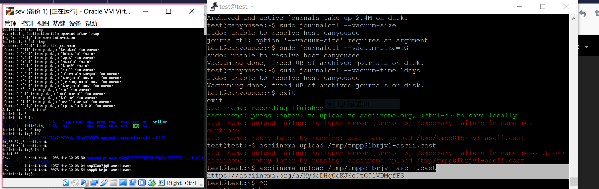

# 实验三：开机自启动项管理之systemd #

---

## 系统管理 ##

[https://asciinema.org/a/84ZojFqhoQ8b7VfX3OtGVt7lB](https://asciinema.org/a/84ZojFqhoQ8b7VfX3OtGVt7lB)

## Unit ##

[https://asciinema.org/a/7EvboJHxlIALgCTR727FOpwVe
](https://asciinema.org/a/7EvboJHxlIALgCTR727FOpwVe)

## Unit的配置 ##

[https://asciinema.org/a/W05VCEs6yRX4bs9WlSDAdDT3m](https://asciinema.org/a/W05VCEs6yRX4bs9WlSDAdDT3m)

## Target和日志管理 ##

[https://asciinema.org/a/MydeDHq0eKJ6c5tC01VDMgfFS](https://asciinema.org/a/MydeDHq0eKJ6c5tC01VDMgfFS)

## 实战 ##

[https://asciinema.org/a/E9tZMFBGfnJKD637LKDvB112r](https://asciinema.org/a/E9tZMFBGfnJKD637LKDvB112r)

## 自查清单 ##

- 如何添加一个用户并使其具备sudo执行程序的权限？
 

 adduser username 

修改/etc/sudoers，在里面添加username ALL=(ALL:ALL)ALL

- 如何将一个用户添加到一个用户组？

adduser username usergroup
    
- 如何查看当前系统的分区表和文件系统详细信息？
  
sudo fdisk -l

  
- 如何实现开机自动挂载Virtualbox的共享目录分区？
    
先建立了分区

但是没查到共享分区应该是什么类型

建了新目录 /home/newshare 然后在/etc/fstab里面做了修改，把分区uuid和挂载点等写进去保存.

共享这块感觉做的有问题，因为主机没设共享分区，在网上查的看的我也没什么思路

`UUID= /home/newshare ext4 auto 0 0`

- 基于LVM（逻辑分卷管理）的分区如何实现动态扩容和缩减容量？

我试着按这个步骤实验，把磁盘分成两个区之后创建物理卷失败，报错没发现或被过滤，在网上搜解决办法还是不行，耗费了好久，最后发现我好傻，动态扩容和缩减容量只要两条命令

 `sudo lvextend -l +xxxx lvpath`

`sudo lvreduce -l -xxxx lvpath`

[https://blog.csdn.net/seteor/article/details/6708025](https://blog.csdn.net/seteor/article/details/6708025)

    
- 如何通过systemd设置实现在网络连通时运行一个指定脚本，在网络断开时运行另一个脚本？

修改配置文件 ‘ExecStart ExecStop’

- 如何通过systemd设置实现一个脚本在任何情况下被杀死之后会立即重新启动？实现杀不死？

修改配置文件，设置重启“alwalys”

## 参考文献 ##

[http://www.ruanyifeng.com/blog/2016/03/systemd-tutorial-commands.html](http://www.ruanyifeng.com/blog/2016/03/systemd-tutorial-commands.html)

[http://www.ruanyifeng.com/blog/2016/03/systemd-tutorial-part-two.html](http://www.ruanyifeng.com/blog/2016/03/systemd-tutorial-part-two.html)

## 备注 ##
上一次录频时没加载出来就按CTRL c 导致没生成链接，在这次录频时发现自动保存到本地tmp路径下，使用命令可重新加载生成链接

