# shell脚本编程报告 #
---
## 1.任务1 ##

**支持命令行参数方式使用不同功能**

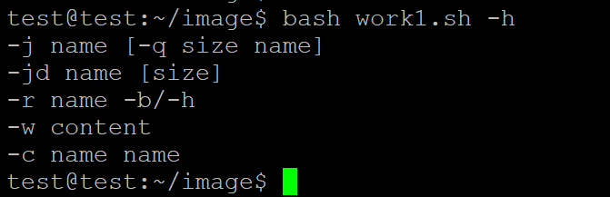

**支持对jpeg格式图片进行图片质量压缩**

    
    bash work1.sh -j test1.jpg -q 50 test150.jpg
 
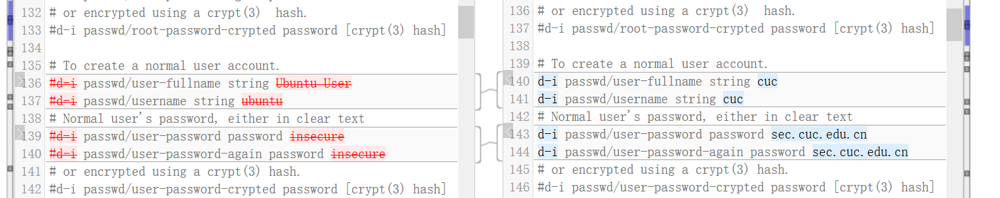  

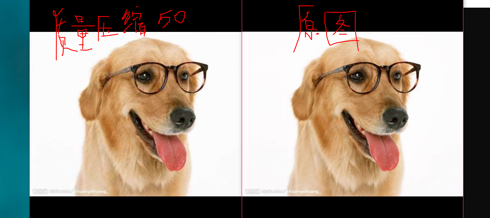

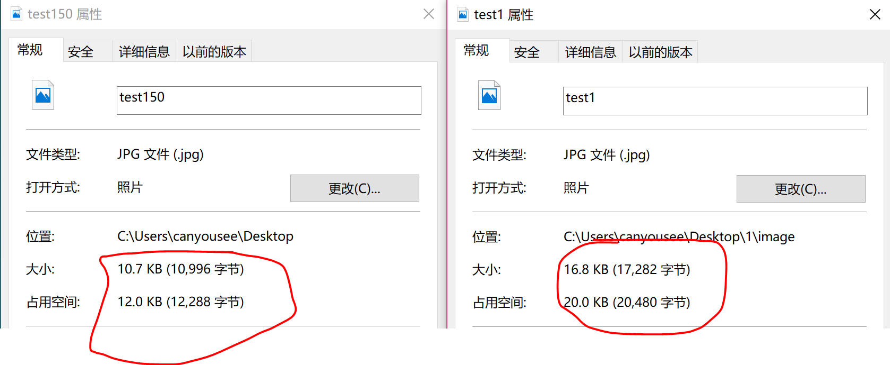

   `bash work1.sh -j test1.jpg `

默认质量压缩参数为92，重命名为原名

 

    bash work1.sh -j test2.jpg -q 50
    
默认重命名为原名

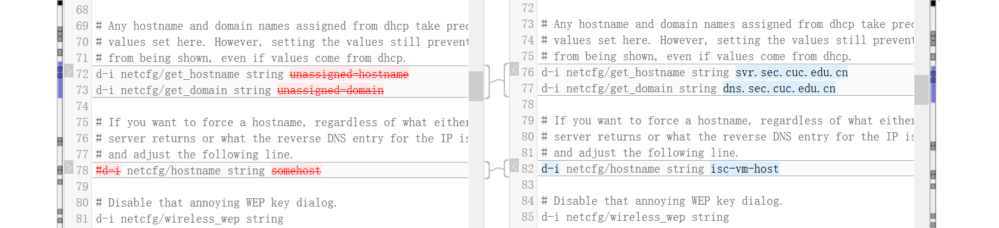

对错误参数的报错

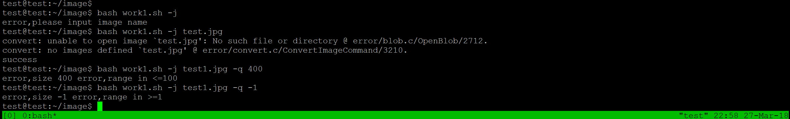

**支持对jpeg/png/svg格式图片在保持原始宽高比的前提下压缩分辨率**

**支持对图片批量添加自定义文本水印**

**支持批量重命名（统一添加文件名前缀或后缀，不影响原始文件扩展名）**

ps：自动跳过png图片

后缀

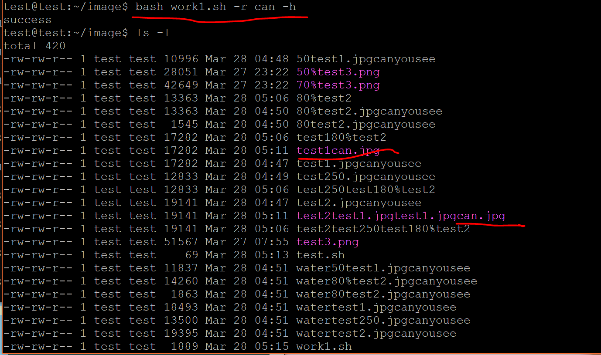

前缀

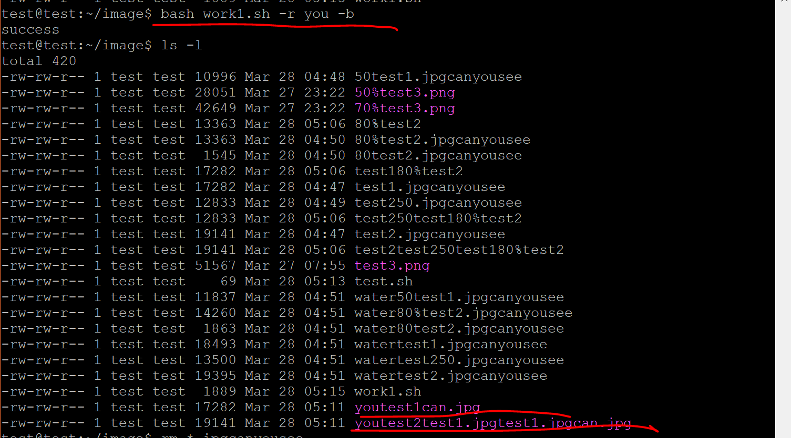

**支持将png图片统一转换为jpg格式图片**

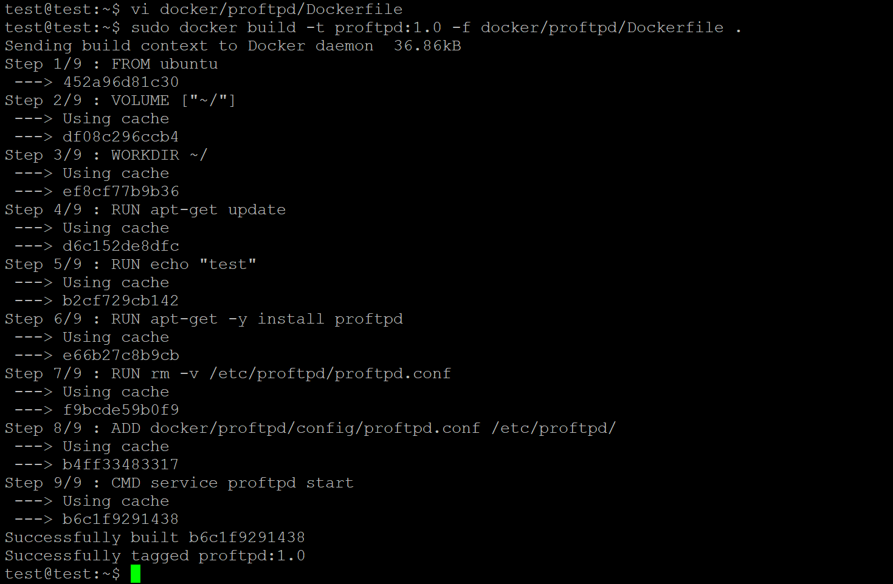

---

## 2.任务1 ##

统计不同年龄区间范围（20岁以下、[20-30]、30岁以上）的球员数量、百分比

统计不同场上位置的球员数量、百分比

名字最长的球员是谁？名字最短的球员是谁？

年龄最大的球员是谁？年龄最小的球员是谁？
 
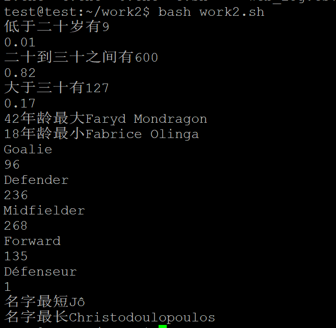
---

## 2.任务2 ##

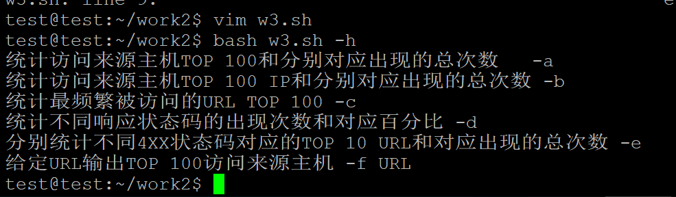

**统计访问来源主机TOP 100和分别对应出现的总次数**

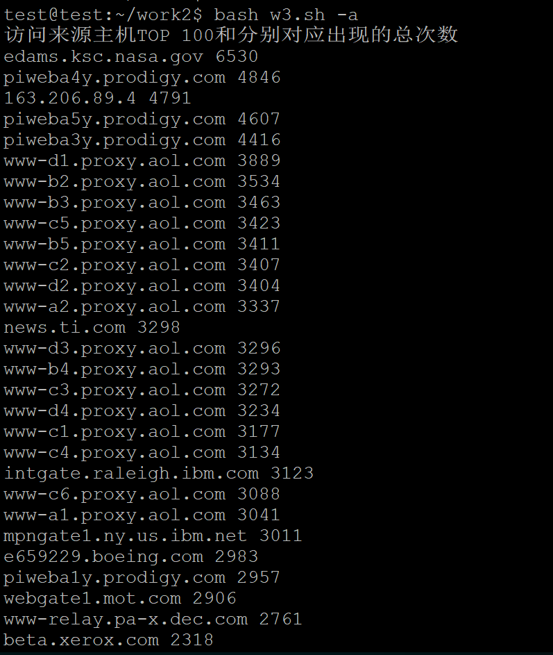

**统计访问来源主机TOP 100 IP和分别对应出现的总次数**

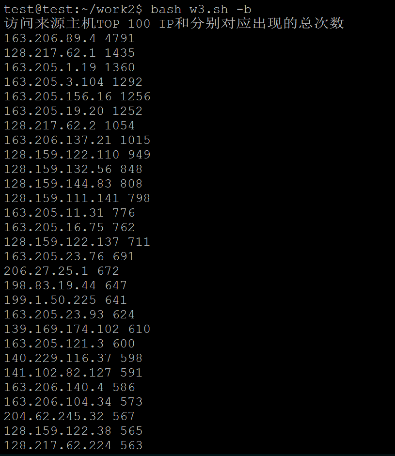
**统计最频繁被访问的URL TOP 100**

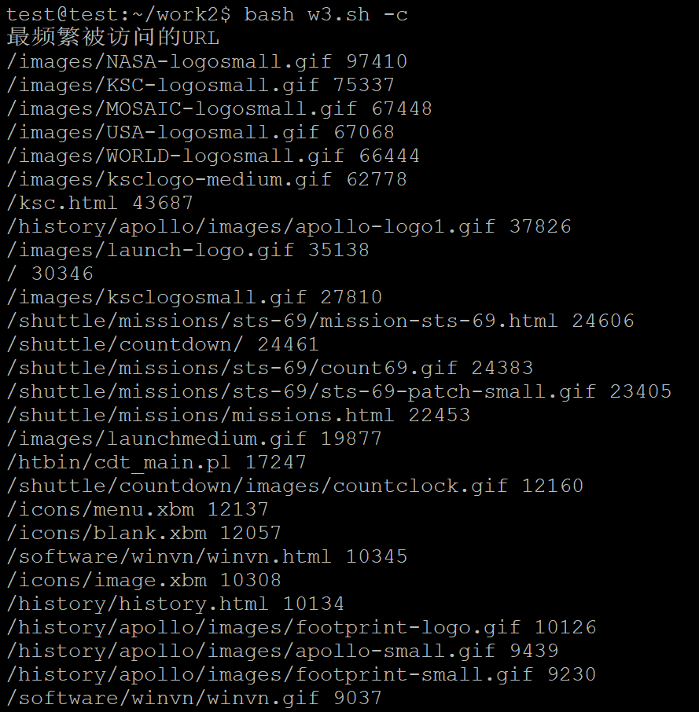

**统计不同响应状态码的出现次数和对应百分比**

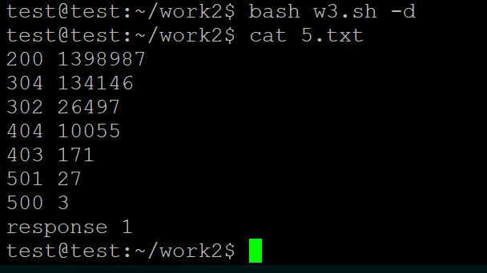

**分别统计不同4XX状态码对应的TOP 10 URL和对应出现的总次数**

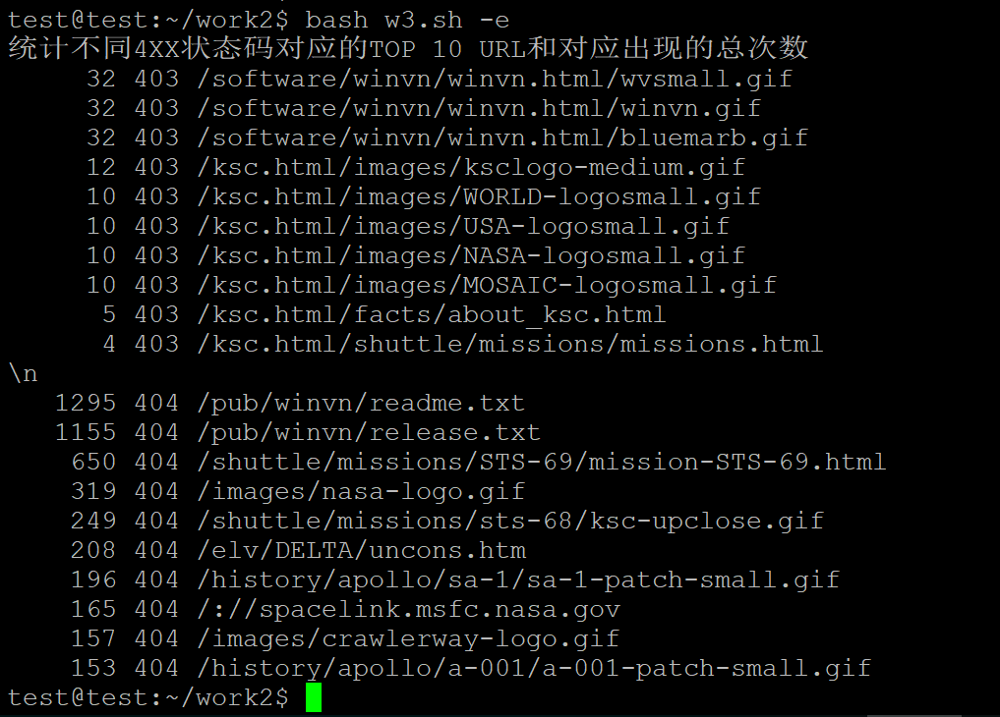

**给定URL输出TOP 100访问来源主机**

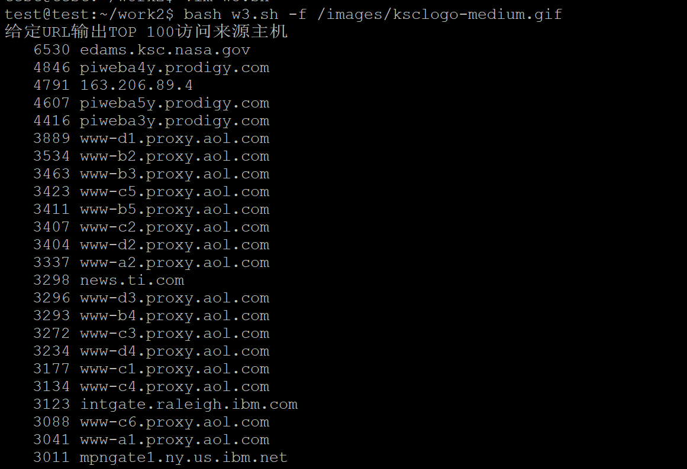

---

