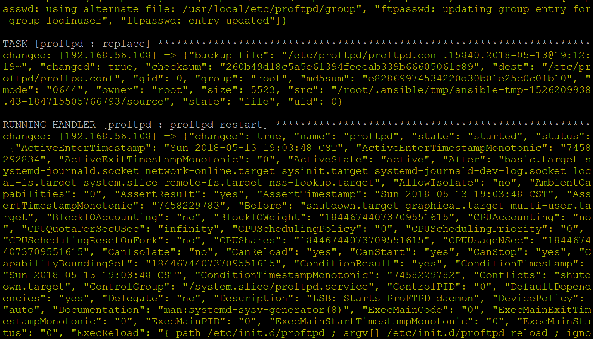
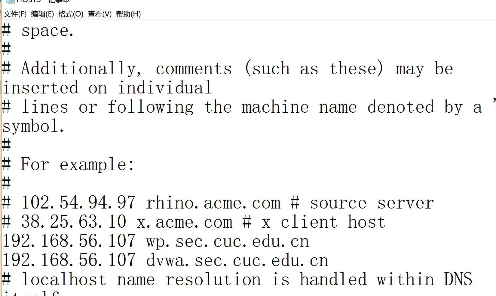
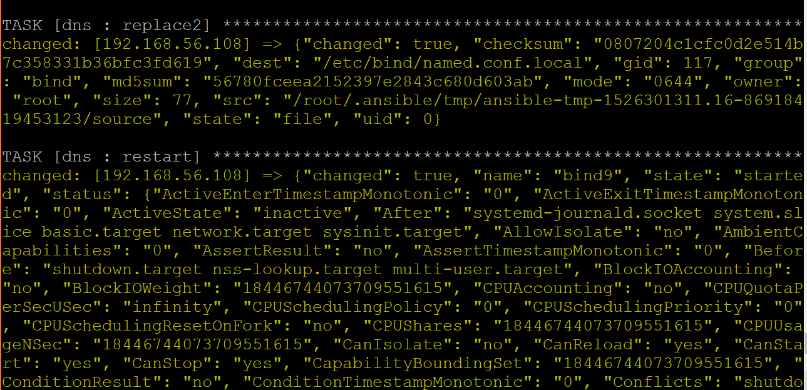
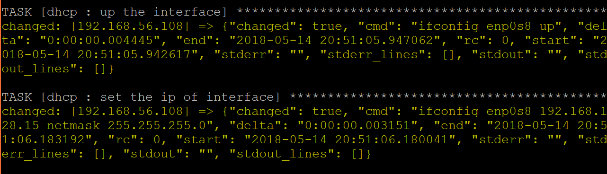

# web服务器实验报告 #
---
## 实验环境 ##
**一**、

ubuntu-server-16.04

搭建verynginx

host-only网卡 192.168.56.104

**二、**

ubuntu-server-16.04

搭建wordpress，nginx，dvwa

host-only网卡 192.168.56.107

## 实验过程 ##
**1.搭建实验环境**

verynginx搭建在一台虚拟机中

wordpress和dvwa搭建在另一台虚拟机中，wordpress占用80端口，dvwa占用8080端口

参考：

[https://www.digitalocean.com/community/tutorials/how-to-install-wordpress-with-lemp-on-ubuntu-16-04](https://www.digitalocean.com/community/tutorials/how-to-install-wordpress-with-lemp-on-ubuntu-16-04)

[https://blogs.technet.microsoft.com/positivesecurity/2017/06/01/setting-up-damn-vulnerable-web-app-dvwa-on-ubuntu-in-azure/](https://blogs.technet.microsoft.com/positivesecurity/2017/06/01/setting-up-damn-vulnerable-web-app-dvwa-on-ubuntu-in-azure/)

**2.实验检查点**

- VeryNginx作为本次实验的Web App的反向代理服务器和WAF

- PHP-FPM进程的反向代理配置在nginx服务器上，VeryNginx服务器不直接配置Web站点服务

- 使用Wordpress搭建的站点对外提供访问的地址为： https://wp.sec.cuc.edu.cn 和 http://wp.sec.cuc.edu.cn

- 使用Damn Vulnerable Web Application (DVWA)搭建的站点对外提供访问的地址为： http://dvwa.sec.cuc.edu.cn

- 使用IP地址方式均无法访问上述任意站点，并向访客展示自定义的友好错误提示信息页面-1

- Damn Vulnerable Web Application (DVWA)只允许白名单上的访客来源IP，其他来源的IP访问均向访客展示自定义的友好错误提示信息页面-2

- 在不升级Wordpress版本的情况下，通过定制VeryNginx的访问控制策略规则，热修复WordPress < 4.7.1 - Username Enumeration

- 通过配置VeryNginx的Filter规则实现对Damn Vulnerable Web Application (DVWA)的SQL注入实验在低安全等级条件下进行防护

- VeryNginx的Web管理页面仅允许白名单上的访客来源IP，其他来源的IP访问均向访客展示自定义的友好错误提示信息页面-3

- 通过定制VeryNginx的访问控制策略规则实现：

   限制DVWA站点的单IP访问速率为每秒请求数 < 50

   限制Wordpress站点的单IP访问速率为每秒请求数 < 20

   超过访问频率限制的请求直接返回自定义错误提示信息页面-4

   禁止curl访问

---
# **三、实验问题** #

做完以上步骤，重新启动两台虚拟机，却再也打不开wordpress和verynginx网页

报错拒绝连接请求

