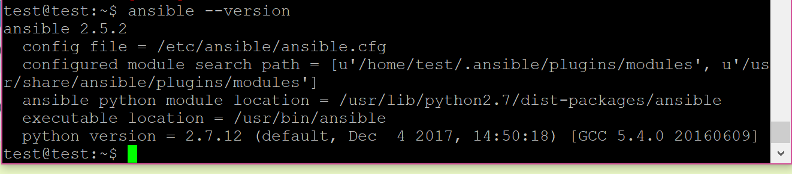
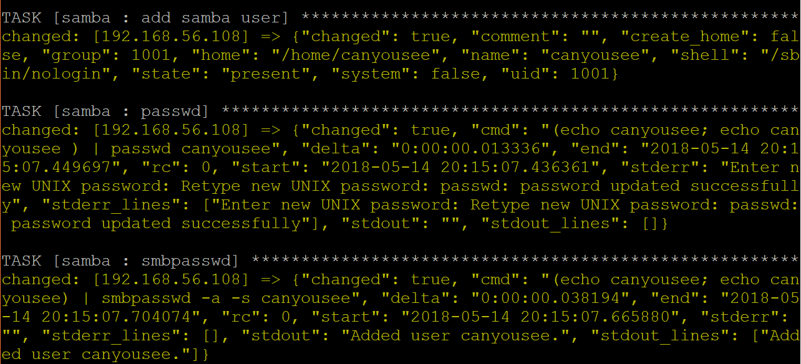
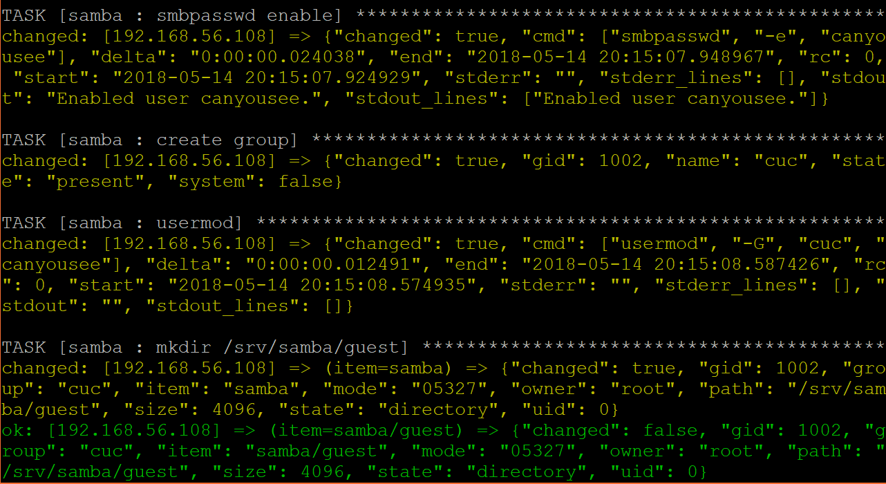
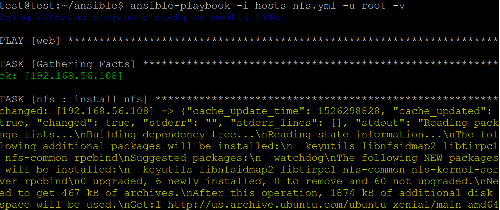
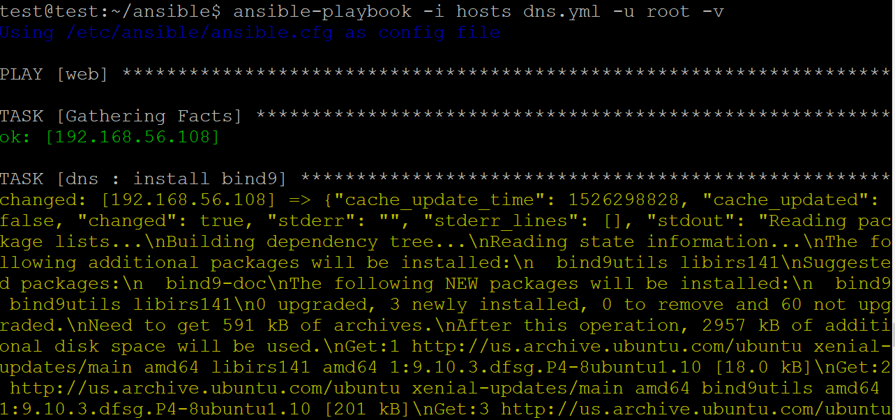
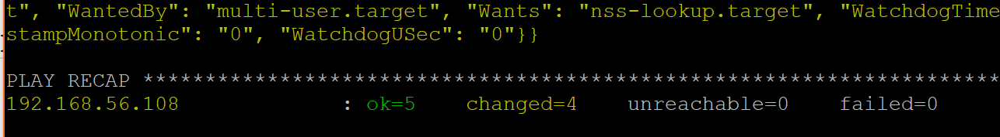
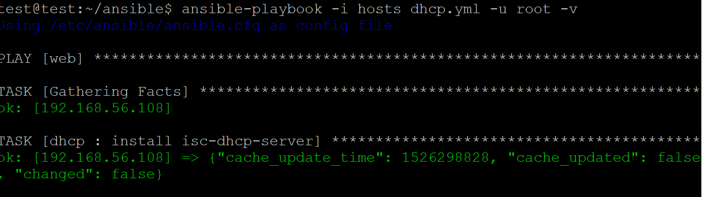
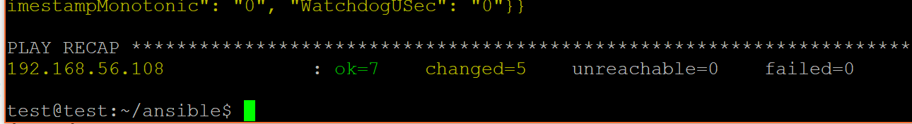

# 实验七：使用ansible 重构FTP、NFS、DHCP、DNS、Samba服务器的自动安装与自动配置 #
---
## 一、安装ansible，配置ssh免密登录，ansible安装配置nginx ##

安装ansible：

	sudo apt-get update
	sudo apt-get install software-properties-common
	sudo apt-add-repository ppa:ansible/ansible
	sudo apt-get update
	sudo apt-get install ansible

参考链接：[http://docs.ansible.com/ansible/latest/installation_guide/intro_installation.html](http://docs.ansible.com/ansible/latest/installation_guide/intro_installation.html)

配置ssh免密登录：

两台虚拟机采用host-only，A机ip：192.168.56.104 B机ip：192.168.56.108

	ssh root@192.168.56.108

参考链接：[https://github.com/c4pr1c3/AnsibleTutorial](https://github.com/c4pr1c3/AnsibleTutorial)

ansible安装配置nginx

	ansible-galaxy install mrlesmithjr.nginx -p roles
	ansible-playbook test.yml -i hosts -u root -v

参考链接：[http://sec.cuc.edu.cn/huangwei/course/LinuxSysAdmin/chap0x08.md.print.html](http://sec.cuc.edu.cn/huangwei/course/LinuxSysAdmin/chap0x08.md.print.html)

---
## 二、ansible安装配置ftp，samba，nfs，dns，dhcp ##

安装配置ftp

	ansible-playbook deploy.yml -i hosts -u root -v

安装配置samba

	ansible-playbook samba.yml -i hosts -u root -v

安装配置nfs

 客户端ip：192.168.56.104

	ansible-playbook nfs.yml -i hosts -u root -v

安装配置dns

	ansible-playbook dns.yml -i hosts -u root -v

安装配置dhcp

	ansible-playbook dhcp.yml -i hosts -u root -v

参考链接：[http://www.ansible.com.cn/](http://www.ansible.com.cn/)

