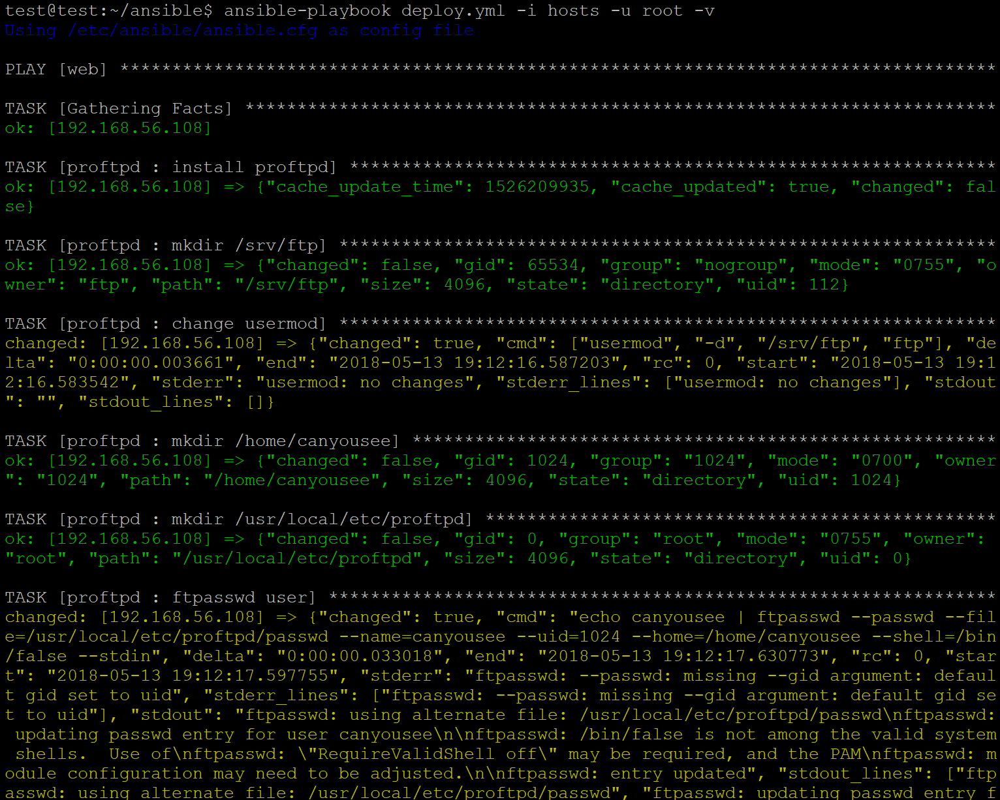
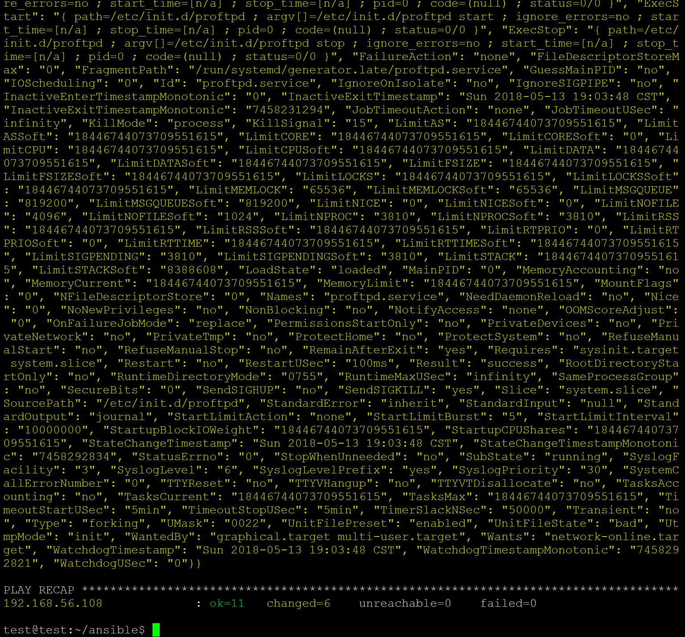
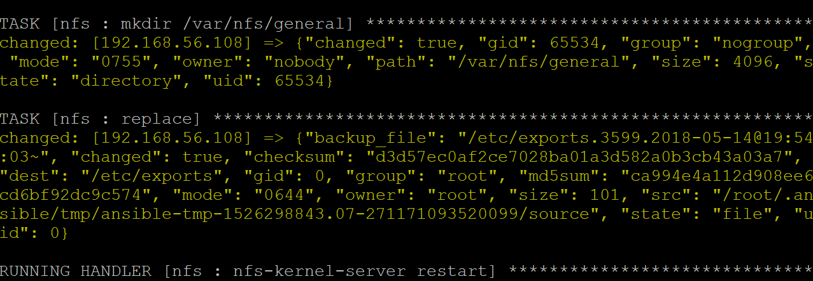
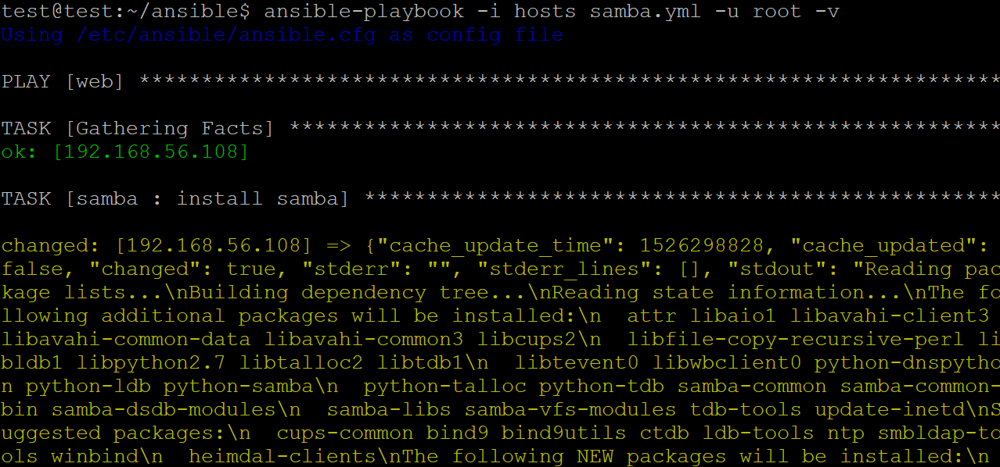

# Ex8:docker install proftpd,samba,nfs,dhcp,dns #

## 一、docker 安装 ##

安装docker主程序

加速访问docker hub

参考：[https://docs.docker.com/install/linux/docker-ce/ubuntu/](https://docs.docker.com/install/linux/docker-ce/ubuntu/)

## 二、一键部署 ##

ftp

	 sudo docker build -t proftpd:1.0 -f Dockerfile .

nfs

	 sudo docker build -t nfs:1.0 -f Dockerfile .

samba

	 sudo docker build -t samba:1.0 -f Dockerfile .

	

dhcp

	 sudo docker build -t dhcp:1.0 -f Dockerfile .

dns

	sudo docker build -t dns:1.0 -f Dockerfile .

